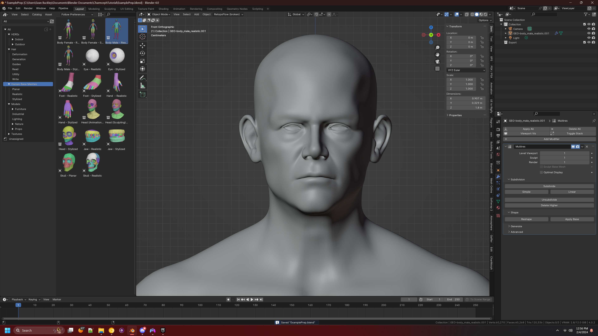
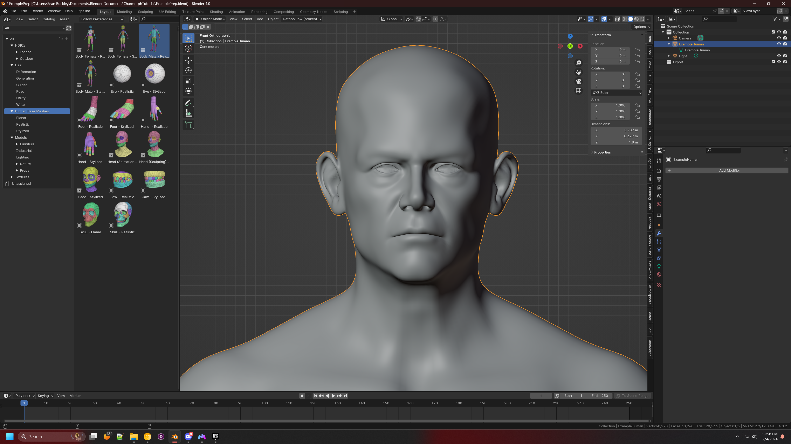
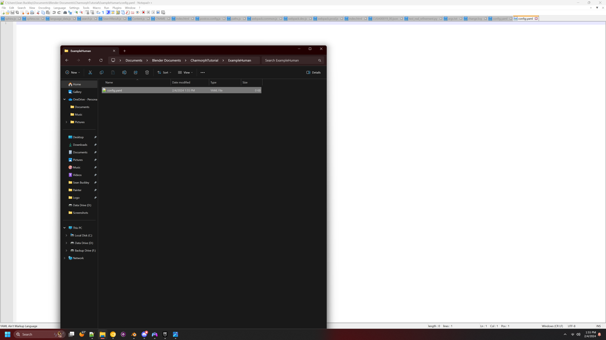
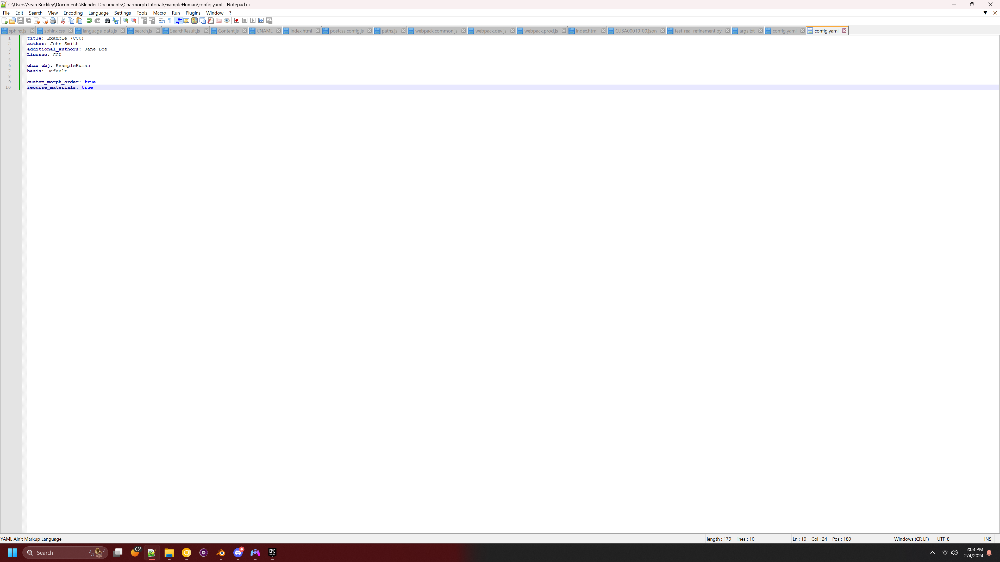

Creating custom characters
======================

.. Creating Characters from scratch

NOTICE
------------
This tutorial is about the technical side of Charmorph, if you wish to learn about Creating a Characters included in Charmorph, see: :ref:`Creating A Character`. Also plese note that this tutorial is not an exhaustive list of Charmorph's Features. Plese check :ref:`Character editing` for a more detailed and technical list.
For Reference We are using the latest commit as of 11:29 PM  February 4th 2024 with Blender 4.0.2 on Windows 11

The Base
------------
You as an artist will likely have a pre-existing character that you wish to create into a charmorph character, However for this tutorial we will use Blender's Human Base Meshes, and delete every object that isn't the body. 
Note that this is just to keep the tutorial as simple as possible.

The Barebasics of Prepping
------------
Every character needs to be stripped down to the bare basics, then be built up again seperately, We can call this process 'prepping your character'. So we will apply the modifiers and rename it to 'ExampleHuman'

Configuration (1)
------------
Characters need to be configured in order for the add-on to recognize it, Lets' create a folder in the add-on folder we will work in. for Windows users that is ``%APPDATA%\Blender Foundation\Blender\4.0\scripts\addons\CharMorph-master\data\characters``.
Once navigated to the ``characters`` folder in your add-on directory, you will create a folder for your character, Lets' call it ``ExampleHuman``.
Within that folder we will create a file named config.yaml

  
  Configuration (2)
------------
Open the newly created config file and set the parameters accordingly for our project we will go like this

:title: This is what the User will see in the add-on drop-down menu
:author: when selected will shown who created the character
:additional_authors: (Optional) Shows who else worked on the character, not shown in add-on
:License: Select your license, Preferably something that can fit within the Blender N-panel length.
:char_obj: what object in the reference blend file will be selected to be created. 
:basis: What is the name of the default reference shapekey the character will have, remember that the character won't shapekeys stored in the blend file.

